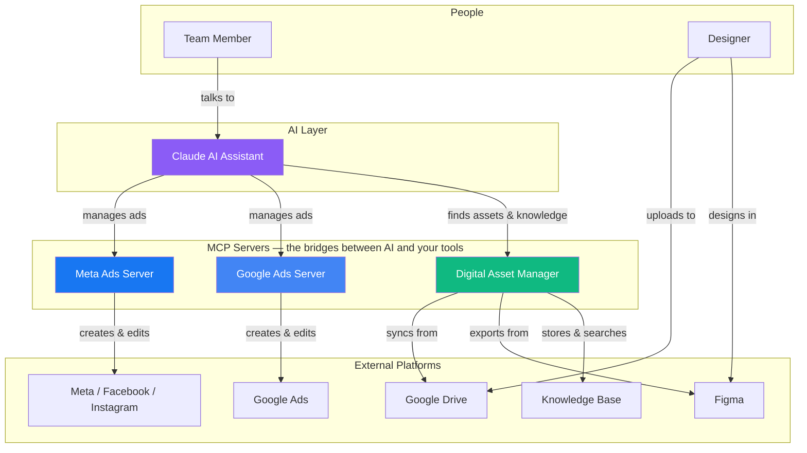
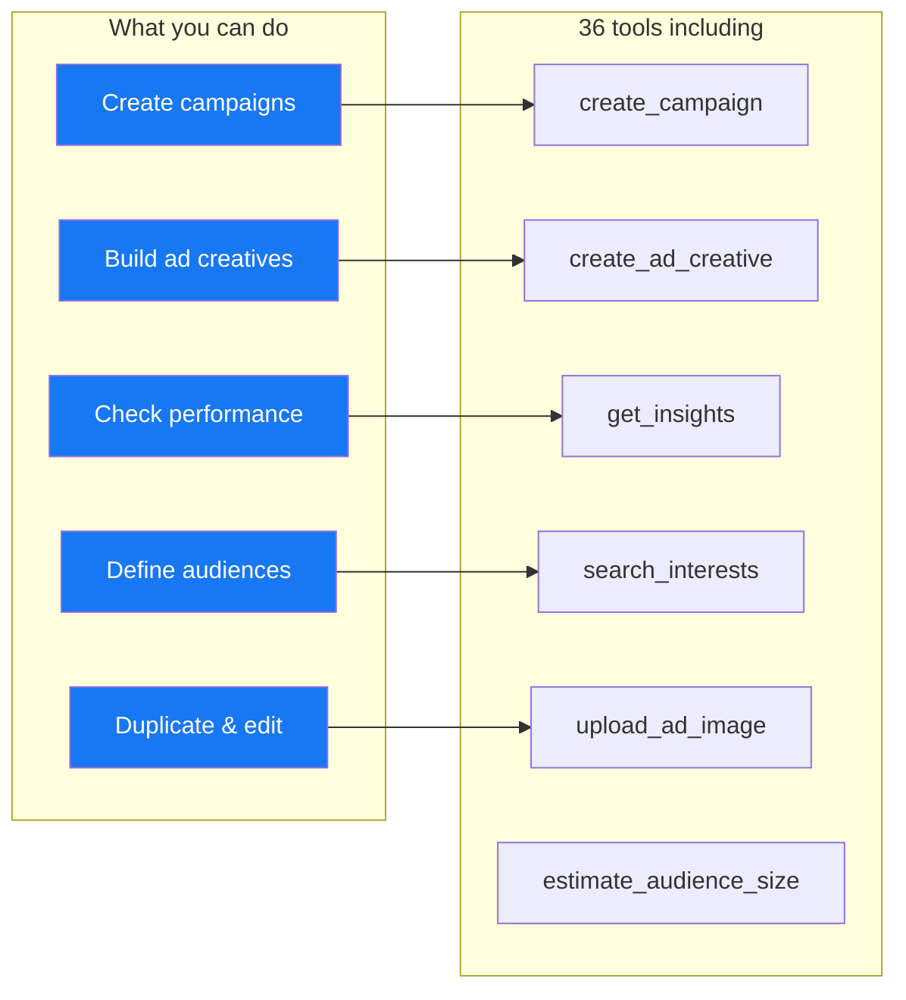
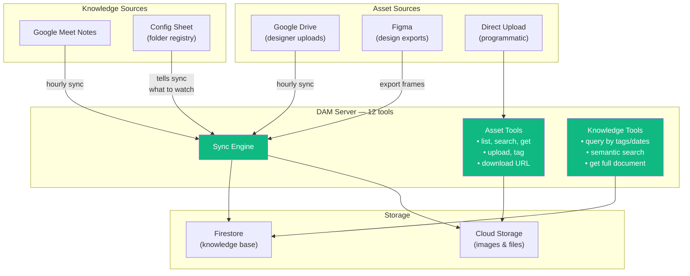
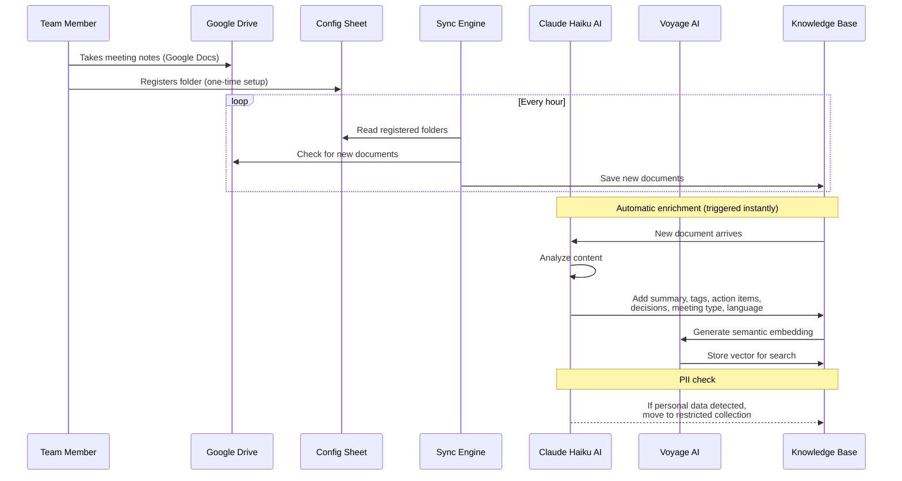
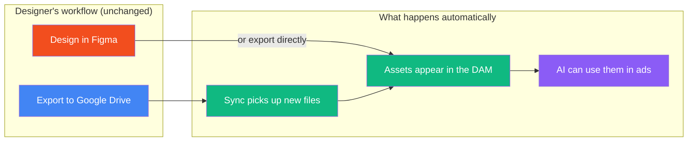
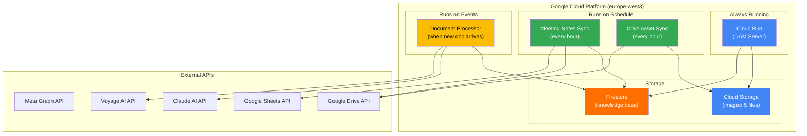
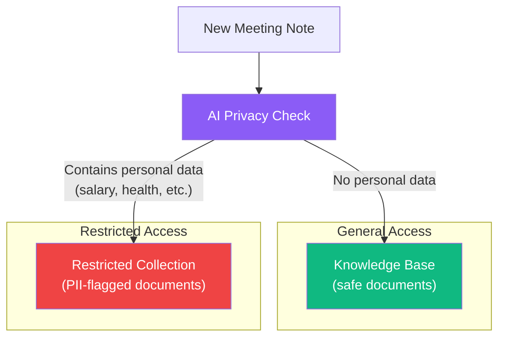

# Ryzon AI Platform — Project Overview

> Making advertising, creative assets, and team knowledge accessible to AI — so your team can focus on strategy, not manual work.

---

## What Is This?

This platform connects **AI assistants** (like Claude) to the tools your team already uses: **Meta Ads**, **Google Ads**, **Google Drive**, **Figma**, and **meeting notes**. Instead of clicking through ad dashboards or digging through shared folders, you simply _ask_ the AI to do it for you.

```
You:    "Create a new Meta ad campaign for our summer collection,
         use the hero image from the DAM, target cycling enthusiasts
         in Germany, and set a daily budget of €50."

Claude: Done. Campaign "Summer Collection 2026" is live.
        Used hero-1080x1080.png from the Summer-2026 folder.
        Targeting 1.2M cycling enthusiasts in DE.
        Daily budget: €50. Here's the preview link: ...
```

No dashboards. No manual uploads. No copy-pasting between tools.

---

## The Big Picture



**How it works:** Claude talks to three specialized servers. Each server is an expert in one domain — ads, assets, or knowledge. The servers handle all the technical details (APIs, authentication, data formats) so Claude can focus on understanding your intent.

---

## The Three Servers

### 1. Meta Ads Server

> Everything you need to run Facebook and Instagram advertising — from campaign creation to performance reporting.



**Key capabilities:**
- Full campaign lifecycle — create, edit, pause, duplicate, delete
- All creative formats — single image, carousel, video, dynamic ads
- Audience targeting — interests, behaviors, demographics, locations, lookalikes
- Performance insights — spend, impressions, clicks, conversions, ROAS
- Image management — upload, manage, and use images in ads
- Ryzon-specific defaults — pre-configured tracking, UTM parameters, and DSA compliance

---

### 2. Google Ads Server

> Manage Google search and display advertising through natural conversation.

**Key capabilities:**
- Campaign and ad group management
- Keyword and audience targeting
- Performance reporting via GAQL queries
- Budget and bid management

---

### 3. Digital Asset Manager (DAM)

> Your creative assets and team knowledge — organized, searchable, and ready for AI.



**Asset management tools:**
| Tool | What it does |
|------|-------------|
| `list_assets` | Browse assets by campaign or folder |
| `search_assets` | Find assets by name, tags, format, or dimensions |
| `get_asset` | Get full metadata for a specific asset |
| `get_asset_download_url` | Generate a secure download link (expires in 60 min) |
| `upload_asset` | Upload a new image or file |
| `tag_asset` | Add or update tags and metadata |
| `export_figma_frames` | Export frames from Figma directly to the DAM |
| `trigger_sync` | Manually start a Drive-to-DAM sync |
| `sync_status` | Check when the last sync ran |

**Knowledge base tools:**
| Tool | What it does |
|------|-------------|
| `query_knowledge_base` | Search meeting notes by tags, date, series, or type |
| `get_document` | Retrieve the full content of a specific document |
| `search_knowledge_base_semantic` | Find documents using natural language (AI-powered) |

---

## The Knowledge Base — How Meeting Notes Become Searchable

One of the most powerful features: your team's meeting notes are automatically collected, enriched by AI, and made searchable.



### What the AI extracts from each meeting note

| Field | Example |
|-------|---------|
| **Summary** | "Team reviewed Q2 roadmap priorities and decided to focus on mobile-first approach" |
| **Tags** | `q2-roadmap`, `mobile`, `product-strategy` |
| **Action items** | "Simon to draft mobile spec by April 14" |
| **Key decisions** | "Mobile-first approach for Q2", "Postpone desktop redesign" |
| **Meeting type** | Planning, Standup, Review, Retro, 1:1, Demo, etc. |
| **Language** | German, English, etc. |
| **Sensitivity** | Safe or Contains PII (personal data) |

### Two types of search

**Tag-based search** — fast, exact matching:
> "Show me all planning meetings tagged with 'erp-selection' from March"

**Semantic search** — AI-powered, finds related content by meaning:
> "What did we discuss about customer onboarding?"
> _(Finds notes even if they never mention "onboarding" — maybe they talked about "new customer setup" or "Kundeneinrichtung")_

---

## How Designers Fit In

Designers don't need to change anything about how they work.



- Designers keep uploading to Google Drive as usual
- The DAM automatically syncs new files every hour
- Figma frames can be exported directly into the DAM
- Assets get tagged and become searchable instantly

---

## Onboarding — For Everyone

### For team members (meeting notes)

1. **Share** your meeting notes Drive folder with the service account
2. **Add a row** to the config spreadsheet (folder ID + your email)
3. **Done** — your notes will sync within the hour

### For Claude Desktop users

Run one command in Terminal:

```bash
curl -fsSL https://raw.githubusercontent.com/.../install.sh | bash
```

The installer handles everything:
- Checks for Python and required tools
- Installs the MCP servers
- Configures Claude Desktop
- Sets up API credentials
- Provides a step-by-step guide for any manual steps

---

## Infrastructure — Where Things Run



**Cost:** Minimal. Cloud Functions are pay-per-use. Firestore and Cloud Storage cost cents per month at current scale. LLM processing costs ~$0.001 per meeting note.

---

## Data Privacy & Security



- AI automatically scans every document for personal data
- Documents with sensitive content are moved to a restricted collection
- Business emails and professional names are **not** flagged (only truly personal data)
- Different access levels can be applied to each collection
- All data stays in the EU (europe-west3 region)

---

## What's Next

| Phase | Status | What it adds |
|-------|--------|-------------|
| **Phase 1** — Asset management | Done | Drive sync, asset search, Figma export |
| **Phase 2** — AI enrichment | Done | LLM tagging, summaries, vector search, PII detection |
| **Phase 3** — More sources | Planned | Granola.ai notes, brand guidelines, project briefs |
| **Phase 4** — Workflows | Planned | Approval flows, versioning, cross-type knowledge graph |

---

## Quick Reference

| Server | Tools | Purpose |
|--------|-------|---------|
| Meta Ads MCP | 36 | Create, manage, and analyze Facebook/Instagram ads |
| Google Ads MCP | 10+ | Create, manage, and analyze Google ads |
| DAM MCP | 12 | Manage creative assets and team knowledge |

| Automation | Frequency | What it does |
|-----------|-----------|-------------|
| Drive Asset Sync | Hourly | Copies new images from Drive to the DAM |
| Meeting Notes Sync | Hourly | Copies new meeting notes to the knowledge base |
| Document Processor | Instant | AI-enriches new documents (tags, summary, embeddings) |

---

*Built by the Ryzon team. Powered by Claude, Meta APIs, Google APIs, Figma, and a lot of automation.*
