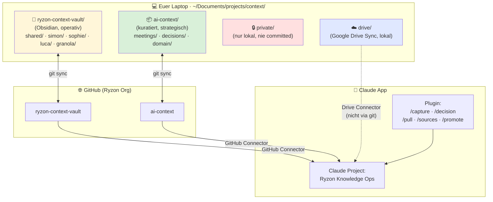

# Knowledge Setup — Meeting mit Sophie & Luca

*Für heute · 30 Min · Ziel: Setup verstehen + offene Punkte gemeinsam entscheiden*

---

## 1. Wie das Setup aussieht (Big Picture)



**Die zwei Welten:**

| | Operativ | Strategisch |
|---|---|---|
| **Wo** | `ryzon-context-vault/` | `ai-context/` |
| **Was** | Tagebuch, Gedanken, Granola-Meetings, Drafts | Kuratierte Meetings, Entscheidungen, Domain-Wissen |
| **Wie entsteht** | `/capture`, direkt in Obsidian, Granola-Auto-Sync | Nur durch **Promotion** (Friday-Ritual) |
| **Wer darf rein** | Jede:r in eigenem Unterordner + `shared/` | Nur gemeinsam approvete Inhalte |
| **Verfügbarkeit** | Obsidian-Graph, Wiki-Links, Tag-Pane | Team-Standard, verlässlich, reproduzierbar |

---

## 2. Was ihr täglich tun werdet

### Die 4 Commands im Plugin

| Command | Wofür | Beispiel |
|---|---|---|
| **`/capture`** | Neue Notiz / Learning / Analyse speichern | `/capture learning Apollo performt 2x besser mit Video` |
| **`/decision`** | Business-Entscheidung mit Begründung dokumentieren | `/decision CRM-Tool-Wahl: HubSpot vs Pipedrive` |
| **`/pull`** | Relevanten Kontext für eine Aufgabe laden | `/pull sales apollo` |
| **`/sources`** | Sehen, welche Files Claude gerade genutzt hat | (nach jeder Antwort aufrufbar) |

**Zusätzlich am Freitag:** `/promote` (nutzt Simon beim gemeinsamen Friday-Ritual)

### Ein typischer Tag

```
Morgens    →  /pull sales        → Kontext geladen, loslegen
Vormittag  →  Arbeit mit Claude  → Antwort nutzt geladenen Kontext
Insight?   →  /capture learning  → strukturiert gespeichert
Entscheidung?  →  /decision      → Schema-geführtes Interview
Nach Chat  →  /sources (optional)→ verifizieren, welcher Kontext gewirkt hat
```

---

## 3. Transparenz & Vertrauen ab Tag 1

**Jede Claude-Antwort zeigt am Ende:**

```
Quellen:
- apollo-2026-q1-analysis.md — Basis für Empfehlung (▶ maßgeblich)
- dec-2026-03-15-video-budget.md — bestehende Entscheidung referenziert
```

**Trust-Level pro Eintrag:** Jede Note trägt eines der drei Label:
- **verified** — geprüft, zuverlässig
- **draft** — Arbeitsstand, noch nicht final
- **raw** — unverarbeitet (z.B. Granola-Export)

Ihr könnt Claude sagen: *"Beantworte nur mit verified Quellen"* — dann nutzt er keine drafts.

---

## 4. Das Friday-Ritual (Promotion operativ → strategisch)

**Jeden Freitag 14:00–14:45, zusammen**

1. **Vorbereitung (automatisch):** Ein Agent sammelt alle operativen Einträge der Woche und schlägt Promotion-Kandidaten vor
2. **Durchgehen (Simon moderiert):** Pro Kandidat entscheiden wir gemeinsam:
   - **Promote** → landet in `ai-context/` (team-standard)
   - **Keep operational** → bleibt im Vault, vielleicht später
   - **Delete** → war nur Scratchpad
3. **Trust-Battery-Check:** Jede:r sagt kurz: *"Wo steht mein Vertrauen in das Setup?"* (20% / 40% / 60% / 80%+)
4. **Retro-Notiz:** Was hat funktioniert, was muss angepasst werden

---

## 5. Die 2-Wochen-Experiment-Regeln

**Was ihr zusagt:**
- ~30 Min/Tag aktive Nutzung
- Mindestens **10 Einträge in Woche 1**, **15 kumuliert in Woche 2**
- **3 Decisions** mit vollem Schema
- Teilnahme am Mittwoch-Check-In (30 Min) und am Friday-Retro (45 Min)

**Was ihr bekommt:**
- Ein Setup, das euer Wissen strukturiert und für Claude nutzbar macht
- Transparenz über alle Quellen jeder Antwort
- Ein Decision-Log, das bei wiederkehrenden Fragen automatisch greift
- Möglichkeit jederzeit auszusteigen, wenn's nicht passt

**Abort-Kriterien** (wann wir ehrlich stoppen):
- Nach Woche 1 <5 Einträge pro Person → Friktion zu hoch
- Lucas Trust-Battery fällt signifikant
- Tech-Blocker blockieren >2 Tage

---

## 6. Was wir NICHT in diesem Experiment machen

- "Marios Bierdeckel" (informelle Gespräche mit Mario) — eigener Epic, separate Session
- Semantic-Search / KI-Tagging — erst wenn Habit steht
- Mario als Nutzer — kommt ab Woche 3
- Externer Berater im Project — Phase 4, wenn Trust-Level etabliert

---

## 7. 🟡 Offene Punkte — das brauchen wir heute von euch

### 7.1 Decision-Log-Schema — passen die Felder?

Vorgeschlagenes Schema pro Decision:

```yaml
question:       "Welche Frage beantwortet die Decision?"
decision:       "Die Entscheidung in einem Satz"
rationale:      "Warum genau so — 3-5 Sätze"
context_used:   [welche Quellen waren Grundlage]
decided_by:     [wer hat mitentschieden]
supersedes:     [id einer älteren Decision, falls es eine gab]
weight:         high (default bei Decisions)
```

**→ Frage:** Fehlt euch ein Feld? Ist eines überflüssig?

### 7.2 Access Control

**Stand jetzt:** Alles in `ai-context` und `ryzon-context-vault` ist für euch drei (Simon, Sophie, Luca) sichtbar. `private/<person>/` ist nur lokal.

**→ Fragen:**
- Was soll Mario ab Woche 3 **nicht** sehen?
- Was soll der externe Berater **später** nicht sehen?
- Wollt ihr eine explizite `sensitivity`-Kategorie in Decisions (z.B. `confidential` für Personalentscheidungen)?

### 7.3 Erfolg des Experiments — wie messen wir?

Bisherige Metriken:
- Einträge pro Person
- Cross-Reads (Sophie liest Lucas, umgekehrt)
- Trust-Battery-Entwicklung

**→ Frage:** Was würde für euch ein erfolgreiches Experiment sein? Was ein klares "das funktioniert nicht"?

### 7.4 Tag-Taxonomie — frei oder kontrolliert?

Zwei Modi:
- **Kontrolliert:** Feste Tag-Liste in Schema, neue Tags nur nach Retro
- **Frei:** Jede:r kann Tags erfinden, Agent normalisiert später

**→ Frage:** Was fühlt sich für euch natürlicher an?

### 7.5 Wer darf Decisions schreiben?

- Jede:r eigenständig → maximale Verteilung
- Mit Peer-Check (die oder der andere approved) → mehr Struktur
- Simon als Gatekeeper → Bottleneck-Risiko

**→ Frage:** Welches Modell für die 2 Wochen?

---

## 8. Next Steps nach dem Meeting

- **Heute Abend (Simon):** Pre-Rollout-Arbeit (Curation, Bug-Fix, Repos anlegen)
- **Morgen / Montag (alle):** 30-Min Install-Session pro Person — ihr seid nach 30 Min einsatzbereit
- **Diese Woche:** ihr startet mit `/pull` und `/capture`
- **Nächster Mittwoch:** Mid-Week Check-In (30 Min)
- **Nächster Freitag:** Erstes Friday-Ritual (45 Min) — inkl. erste Promotions

---

**Bereit?**
